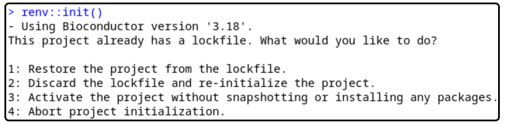

# mimesis project


## Repo setup

Clone the repo into a desired folder:

```
git clone https://github.com/cibiobcg/scna_cfDNA.git
```

First time launching the script?
open an R/Rstudio session and run:

```R
install.package("renv")
renv::init()
```



and select *Restore project from the lockfile*, selection 1.

Renv will activate automatically when running ```Rscript main.R```.
If renv does not activate When opening a console/open Rstudio session run the command:

```R
renv::activate()
```


## How to

To run a new analysis modify the parameters of ```config.yml``` keeping the same structure.
The "main" item of the ```config.yml``` **MUST** be ```default``` for the correct running of the script.
The run parameters (```files```, ```paths```, ```ref```, ```sample```, ```system```) **MUST** be contained in one item (e.g. ```run```) the name is not important. 


```yaml
default:
  run:
    files:
      bands: path/to/bands
      bed: path/to/bed
      controls: path/to/controls_path_list.txt
      samples: path/to/samples_path_list.txt
    paths:
      ref: ./data/reference
      out: dir/to/save/outputs
    ref:
      overwrite: yes
      minaf: 0.2
      maxaf: 0.8
      mincov: 10
      centeraf: yes
      cov.bin: 0.1
      maskratio: 0.5
    sample:
      minaf: 0.1
      maxaf: 0.9
      mincov: 10.0
      minsnps: 10.0
      zthr: 1.96
      evidencethr: 0.2
    system:
      njobs: 48
```

Multiple runs can be performed adding more *run* setup in the config with different names


```yaml
default:
  run1:
    files:
      bands: path/to/bands
      bed: path/to/bed
      controls: path/to/controls_path_list.txt
      samples: path/to/samples_path_list_1.txt
    paths:
      ref: ./data/reference
      out: dir/to/save/outputs1
    ref:
      overwrite: yes
      minaf: 0.2
      maxaf: 0.8
      mincov: 10
      centeraf: yes
      cov.bin: 0.1
      maskratio: 0.5
    sample:
      minaf: 0.1
      maxaf: 0.9
      mincov: 10.0
      minsnps: 10.0
      zthr: 2.58
      evidencethr: 1
    system:
      njobs: 48
  run2:
    files:
      bands: path/to/bands
      bed: path/to/bed
      controls: path/to/controls_path_list.txt
      samples: path/to/samples_path_list_2.txt
    paths:
      ref: ./data/reference
      out: dir/to/save/outputs2
    ref:
      overwrite: yes
      minaf: 0.2
      maxaf: 0.8
      mincov: 10
      centeraf: yes
      cov.bin: 0.1
      maskratio: 0.5
    sample:
      minaf: 0.1
      maxaf: 0.9
      mincov: 10.0
      minsnps: 10.0
      zthr: 1.96
      evidencethr: 0.2
    system:
      njobs: 48
```

!!Generated outputs will overwrite existing output folder. 

When ```config.yml``` is ready run the script:

```bash
Rscript main.R
```


## Parameters

Run parameters include:

* ```files``` containing the path to input files, in particular the ```bed``` file, ```bands``` files and a list (one sample path per row) of the samples pileups (generated with [PacBAM](https://bitbucket.org/CibioBCG/pacbam/src/master/)) paths of ```controls.txt``` and ```samples.txt``` to analyze. Although two pileup files per sample are needed (```.rc```, ```.snps``` ) only one path must be inserted in the input txt files (is not relevant which one).

* ```paths```

* ```ref```

* ```sample```

* ```system```
        


